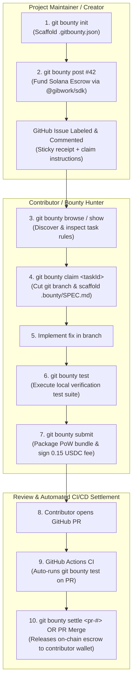

<p align="center">
  <h1 align="center">⚡ Git-bounty</h1>
  <p align="center">
    <strong>The Native Git CLI Extension, GitHub Actions CI/CD Engine, and Terminal Dashboard for the Gibwork Solana Bounty Protocol</strong>
  </p>
  <p align="center">
    <a href="#-hackathon-project-summary"></a>
    <a href="#-gibwork-toolset-used"></a>
    <a href="#-automated-testing--verification"></a>
    <a href="#license"></a>
  </p>
  <p align="center">
    <a href="#-hackathon-project-summary">Project Summary</a> •
    <a href="#-architecture--workflow">Architecture</a> •
    <a href="#-installation--prerequisites">Install</a> •
    <a href="#-configuration--environment-variables">Configuration</a> •
    <a href="#-complete-command-reference--sample-io">Command Reference & Sample I/O</a> •
    <a href="#-exported-deliverables--generated-artifacts">Deliverables & Artifacts</a> •
    <a href="#-github-actions-cicd-engine">CI/CD Engine</a>
  </p>
</p>

---

## Hackathon Project Summary

### 1. Bounty Use Case
**`git-bounty`** is a developer-first toolchain that turns native Git into an on-chain Gibwork client and integrates Gibwork directly into GitHub CI/CD pipelines. 

Instead of requiring developers to leave their code editor and navigate web browsers to search, claim, work on, or settle bounties:
- **Maintainers** fund GitHub issues as Solana bounties directly from their terminal (`git bounty post 42 --reward 50`).
- **Contributors** discover bounties, auto-checkout dedicated git branches, receive scaffolded markdown specifications, verify fixes with local test suites, and submit cryptographically signed Proof-of-Work bundles (`git bounty claim`, `git bounty test`, `git bounty submit`).
- **DevOps / CI/CD**: When a contributor's Pull Request passes CI and is merged, GitHub Actions automatically executes `@gibwork/sdk`'s `submissions.approve()` to release the escrow payout on Solana.

### 2. Why This Is Valuable
Existing bounty platforms suffer from severe context switching: developers write code in terminals and Git, but have to manage bounties in external browser tabs. 

`git-bounty` eliminates this friction:
1. **Zero Browser Required**: 100% of the bounty lifecycle (post, fund, browse, claim, test, submit, review, settle) is executable via native Git commands.
2. **Quality Enforcement via Automated Proof-of-Work**: Bounties cannot be submitted with broken code. `git-bounty` executes the repo's test suite, captures diff metrics and commit hashes, and packages them into a verifiable PoW bundle.
3. **Automated Merge-to-Payout**: Eliminates manual escrow release friction. Merging the PR on GitHub instantly settles the bounty on-chain.

### 3. Gibwork Toolset Used
- **`@gibwork/sdk` (Node.js SDK)**: Used as the core engine across the entire lifecycle:
  - Escrow task creation and funding transactions on Solana.
  - Live task discovery and query filtering (tags, rewards, tokens).
  - Anti-spam submission participation fee transactions (0.15 USDC).
  - Contributor submission approval and on-chain escrow release.
- **Native Git Subcommand CLI (`git-bounty`)**: Integrated into Git via executable binary in PATH.
- **GitHub Actions Engine (`action.yml`)**: Turnkey CI/CD automation.
- **Ink + React**: Interactive full-screen terminal user interface.

---

## Architecture & Workflow



---

## Installation & Prerequisites

### Prerequisites
* **Node.js**: `>= 22.0.0`
* **Git**: `>= 2.30.0`
* **Solana Keypair**: (Optional for viewing/claiming; required for creating bounties or submitting deliverables)

### Global Installation (CLI & Git Subcommand)

```bash
# 1. Clone the repository
git clone https://github.com/Blackwrld04/Git-Bounty.git
cd Git-Bounty

# 2. Install dependencies and compile
npm install
npm run build

# 3. Create global symlink (accessible everywhere as `git bounty`)
mkdir -p ~/.local/bin
ln -sf $(pwd)/dist/bin/git-bounty.js ~/.local/bin/git-bounty
export PATH="$HOME/.local/bin:$PATH"
```

Verify the installation:
```bash
git bounty -h
# or
git-bounty --help
```

---

## Configuration & Environment Variables

### 1. Environment Variables

| Variable | Description | Required For |
| :--- | :--- | :--- |
| `SOLANA_PRIVATE_KEY` | Array of numbers (e.g. `[1,2,3...]`) or base58 secret key | Posting bounties & submitting deliverables |
| `SOLANA_KEYPAIR_PATH` | Absolute path to a Solana keypair JSON file | Alternative to `SOLANA_PRIVATE_KEY` |
| `GITHUB_TOKEN` | Personal Access Token with `repo` scope | Posting issues, PR comments, and merging |
| `GIBWORK_NETWORK` | `production` (default) or `stage` (devnet) | Network environment selection |
| `SOLANA_RPC_URL` | Custom Solana RPC endpoint URL | Optional override for default RPC |

### 2. Repository Configuration (`.gitbounty.json`)
Run `git bounty init` to generate the project manifest:

```json
{
  "version": "1",
  "network": "production",
  "defaultToken": "EPjFWdd5AufqSSqeM2qN1xzybapC8G4wEGGkZwyTDt1v",
  "defaultTokenSymbol": "USDC",
  "testCommand": "npm test",
  "bounties": {}
}
```

---

## Complete Command Reference & Sample I/O

### 1. `git bounty init`
* **Role**: Maintainer
* **Description**: Initializes `.gitbounty.json` repository config, auto-detecting package managers and test suites.

**Sample Command:**
```bash
git bounty init -y
```

**Sample Output:**
```
✔ Detected repository: Blackwrld04/Git-Bounty
✔ Detected test runner: "npm test"
✔ Created .gitbounty.json (Network: PRODUCTION, Default Token: USDC)

╭─────────────────────────────────────────────────────────╮
│                                                         │
│   ⚡ git-bounty initialized successfully!               │
│                                                         │
│   • Config File:   .gitbounty.json                      │
│   • Test Command:  npm test                             │
│   • Network:       PRODUCTION                           │
│                                                         │
│   To post your first bounty:                            │
│     git bounty post <issue-#> --reward <amount>         │
│                                                         │
╰─────────────────────────────────────────────────────────╯
```

---

### 2. `git bounty post <issue-number>`
* **Role**: Maintainer / Sponsor
* **Description**: Creates and funds a Gibwork Solana escrow directly from a GitHub issue.

**Sample Command:**
```bash
git bounty post 42 --reward 50 --token USDC --tags "bug,typescript"
```

**Sample Output:**
```
- Fetching GitHub Issue #42: "Fix memory leak in websocket stream"...
✔ Retrieved issue context from GitHub.
- Funding 50 USDC escrow on Solana via @gibwork/sdk...
✔ Solana transaction confirmed: 4uQ3...9Zpk
✔ Labeled GitHub Issue #42 with [bounty: 50 USDC]
✔ Commented claim instructions on GitHub Issue #42.

╭─────────────────────────────────────────────────────────╮
│                                                         │
│  Bounty Created & Funded On-Chain!                  │
│                                                         │
│   • Issue:         #42 (Fix memory leak in websocket)   │
│   • Escrow Pool:   50 USDC                              │
│   • Task ID:       8f73ad0b-8cfb-43ba-a574-a9499303acd5 │
│   • Solana TX:     https://solscan.io/tx/4uQ3...9Zpk    │
│                                                         │
│   Contributors can now claim with:                      │
│     git bounty claim 42                                 │
│                                                         │
╰─────────────────────────────────────────────────────────╯
```

---

### 3. `git bounty browse`
* **Role**: Contributor / Hunter
* **Description**: Discovers active on-chain bounties on Gibwork with filters for tokens, rewards, and skills.

**Sample Command:**
```bash
git bounty browse --limit 3
```

**Sample Output:**
```
- Fetching active bounties from Gibwork (PRODUCTION)...

⚡ Available Gibwork Bounties (3 found on PRODUCTION)

┌──────────────────────────────────────┬────────────────────────────────┬──────────────┬──────────┬──────────┬──────────────────┐
│ Task ID                              │ Title                          │ Bounty Pool  │ Token    │ Per Sub  │ Tags             │
├──────────────────────────────────────┼────────────────────────────────┼──────────────┼──────────┼──────────┼──────────────────┤
│ bc9c5425-af90-419a-a0da-918232c15bc2 │ FLAUNT YOUR VERYCHAT STREAKS   │ 5            │ USDC     │ 1        │ Development      │
├──────────────────────────────────────┼────────────────────────────────┼──────────────┼──────────┼──────────┼──────────────────┤
│ cc14599e-ed38-4bdc-b55a-09cd8f8c1010 │ Refer. Share. Win upto $300... │ 120          │ CREDITS  │ 10       │ Social Media     │
├──────────────────────────────────────┼────────────────────────────────┼──────────────┼──────────┼──────────┼──────────────────┤
│ b3a45773-f2f9-4b12-844e-b8a635e4bc6f │ Share Your BASIS Numbers P...  │ 150          │ USDC     │ 1        │ Social Media     │
└──────────────────────────────────────┴────────────────────────────────┴──────────────┴──────────┴──────────┴──────────────────┘

To inspect full details: git bounty show <taskId>
To claim and start:      git bounty claim <taskId>
```

---

### 4. `git bounty show <taskId>` *(Alias: `git bounty info`)*
* **Role**: Contributor / Hunter
* **Description**: Inspects complete task specifications, instructions, sponsor reputation, and deadline formatted in clean Markdown.

**Sample Command:**
```bash
git bounty show cc14599e-ed38-4bdc-b55a-09cd8f8c1010
```

**Sample Output:**
```
- Fetching details for bounty "cc14599e-ed38-4bdc-b55a-09cd8f8c1010"...

╭─────────────────────────────────────────────────────────╮
│                                                         │
│   ⚡ Refer. Share. Win upto $300 USDC                   │
│                                                         │
│   • Task ID:     cc14599e-ed38-4bdc-b55a-09cd8f8c1010   │
│   • Bounty Pool: 120 CREDITS (~$300)                    │
│   • Payout/Sub:  10 CREDITS                             │
│   • Creator:     teamdefidotcom (100% rating)           │
│   • Deadline:    Oct 11, 2026, 07:30 PM GMT+1           │
│   • Submissions: 185 pending / 0 approved               │
│   • Tags:        Social Media                           │
│   • Network:     PRODUCTION                             │
│                                                         │
╰─────────────────────────────────────────────────────────╯

Task Description & Instructions:
────────────────────────────────────────────────────────────
**Upto 30 Winners win upto $300 USDC**

Sign up on defi.com and put your referral link to work!
(Bonus rewards unlock for users with 5 or more successful referrals)

It’s super simple to enter!

**How to Enter**
- Post about defi.com on X and share your referral link.
- On gibwork, submit your registered email plus a public tweet link below for a review.

**Note:**
> The submitted email must match the email you used while signing up.
> Quality posts only. Spam, or low-effort submissions will be disqualified.
> Multiple entries allowed.
────────────────────────────────────────────────────────────

Next Actions:
  • Claim and start working: git bounty claim cc14599e-ed38-4bdc-b55a-09cd8f8c1010
  • Test your fix locally:   git bounty test
  • Submit completed work:   git bounty submit --task cc14599e-ed38-4bdc-b55a-09cd8f8c1010
```

---

### 5. `git bounty claim <identifier>`
* **Role**: Contributor / Hunter
* **Description**: Claims a bounty, auto-checks out an isolated git branch, and scaffolds a `.bounty/SPEC.md` deliverable checklist.

**Sample Command:**
```bash
git bounty claim cc14599e-ed38-4bdc-b55a-09cd8f8c1010
```

**Sample Output:**
```
- Resolving bounty details for "cc14599e-ed38-4bdc-b55a-09cd8f8c1010"...
✔ Identified bounty: "Refer. Share. Win upto $300 USDC"
- Checking out bounty branch: bounty/task-cc14599e...
✔ Switched to branch bounty/task-cc14599e

╭──────────────────────────────────────────────────────────╮
│                                                          │
│   Bounty Claimed Successfully!                        │
│   • Title:        Refer. Share. Win upto $300 USDC       │
│   • Task ID:      cc14599e-ed38-4bdc-b55a-09cd8f8c1010   │
│   • Bounty Pool:  120 CREDITS                            │
│   • Payout / Sub: 10 CREDITS                             │
│   • Creator:      teamdefidotcom (100% rating)           │
│   • Deadline:     Oct 11, 2026, 07:30 PM GMT+1           │
│   • Active Branch: bounty/task-cc14599e                  │
│   • Spec File:    .bounty/SPEC.md                        │
│                                                          │
╰──────────────────────────────────────────────────────────╯

Next Steps:
  1. Open .bounty/SPEC.md for the full specification & deliverable checklist.
  2. Implement your work and run: git bounty test
  3. Package and submit:           git bounty submit
```

---

### 6. `git bounty test`
* **Role**: Contributor / Hunter
* **Description**: Executes the repository's verification test suite to ensure code quality before submission.

**Sample Command:**
```bash
git bounty test
```

**Sample Output:**
```
- Executing test suite: "npm test"...
✔ Test suite passed cleanly (10 tests passed, 0 failures, duration: 1840ms)
```

---

### 7. `git bounty submit`
* **Role**: Contributor / Hunter
* **Description**: Packages commit hashes, diff metrics, and test output into a Proof-of-Work bundle, signs the 0.15 USDC anti-spam fee, and broadcasts to Gibwork.

**Sample Command:**
```bash
git bounty submit --pr https://github.com/owner/repo/pull/15
```

**Sample Output:**
```
- Checking git working tree...
✔ Working tree is clean. Active commit: e39b2f1
- Verifying test suite...
✔ Test suite passed (duration: 1.84s).
- Packaging Proof of Work bundle...
  • Commit: 702c526
  • Diffs:  +142 insertions, -12 deletions across 4 files
- Signing 0.15 USDC submission participation fee on Solana...
✔ Transaction confirmed: 3yKn...78aB
✔ Deliverable submitted to Gibwork Task cc14599e-ed38-4bdc-b55a-09cd8f8c1010!
```

---

### 8. `git bounty review <identifier>`
* **Role**: Maintainer
* **Description**: Reviews incoming contributor submissions and inspects proof-of-work diffs.

**Sample Command:**
```bash
git bounty review 15
```

---

### 9. `git bounty settle <pr-number>`
* **Role**: Maintainer
* **Description**: Merges the GitHub Pull Request and triggers on-chain escrow release to the contributor.

**Sample Command:**
```bash
git bounty settle 15 --rating 5
```

**Sample Output:**
```
- Approving Gibwork submission on Solana via @gibwork/sdk...
✔ Escrow payout released: 50 USDC transferred to contributor 7xP...9Za
- Merging GitHub Pull Request #15...
✔ Pull Request #15 merged successfully.
✔ Posted payment receipt and transaction hash to GitHub PR.
```

---

### 10. `git bounty dashboard` *(Alias: `git bounty tui`)*
* **Role**: Contributor & Maintainer
* **Description**: Launches full-screen interactive React/Ink Terminal User Interface with split-pane navigation.

**Sample Command:**
```bash
git bounty dashboard
```

---

## Exported Deliverables & Generated Artifacts

`git-bounty` automatically generates standardized artifacts during the development lifecycle:

### 1. Auto-Scaffolded Specification (`.bounty/SPEC.md`)
Generated upon running `git bounty claim`:
```markdown
# ⚡ Bounty Specification: Fix edge case in Solana deserializer
## Overview
* **Task ID**: `cc14599e-ed38-4bdc-b55a-09cd8f8c1010`
* **Bounty Pool**: **120 CREDITS**
* **Payout Per Approved Submission**: 10 CREDITS
* **Creator / Sponsor**: teamdefidotcom (100% rating)
* **Deadline**: Oct 11, 2026, 07:30 PM GMT+1
* **Active Git Branch**: `bounty/task-cc14599e`
* **Status**: In Progress

---
## Description & Instructions
Implement robust boundary checks when deserializing variable length byte arrays...

---
## Deliverables Checklist
- [ ] Review instructions and criteria above.
- [ ] Implement required code changes or deliverables.
- [ ] Run tests: `git bounty test` (Must pass with 0 errors).
- [ ] Commit your changes to git branch: `bounty/task-cc14599e`.
- [ ] Submit proof-of-work: `git bounty submit`.
```

### 2. Cryptographic Proof-of-Work (PoW) Bundle
Packaged upon running `git bounty submit`:
```json
{
  "taskId": "cc14599e-ed38-4bdc-b55a-09cd8f8c1010",
  "branch": "bounty/task-cc14599e",
  "commitHash": "702c5268c356b738914ba12",
  "prUrl": "https://github.com/owner/repo/pull/15",
  "diffStats": {
    "filesChanged": 3,
    "insertions": 84,
    "deletions": 12
  },
  "testExecution": {
    "command": "npm test",
    "passed": true,
    "durationMs": 1840,
    "exitCode": 0
  },
  "timestamp": "2026-09-20T18:09:50.000Z"
}
```

---

## GitHub Actions CI/CD Engine

Included with `git-bounty` is a production-ready reusable GitHub Action ([`action.yml`](action.yml)) and workflow ([`.github/workflows/bounty-ci.yml`](.github/workflows/bounty-ci.yml)):

```yaml
name: Gibwork Bounty CI/CD Engine

on:
  pull_request:
    types: [opened, synchronize, closed]

jobs:
  # 1. Automated PR Verification
  verify:
    if: github.event.action != 'closed'
    runs-on: ubuntu-latest
    steps:
      - uses: actions/checkout@v4
      - uses: actions/setup-node@v4
        with:
          node-version: 22
      - run: npm install
      - run: npx git-bounty test --cmd "npm test"

  # 2. Automated Merge-to-Payout Escrow Release
  settle:
    if: github.event.action == 'closed' && github.event.pull_request.merged == true
    runs-on: ubuntu-latest
    steps:
      - uses: actions/checkout@v4
      - uses: actions/setup-node@v4
        with:
          node-version: 22
      - name: Settle On-Chain Gibwork Escrow
        env:
          SOLANA_PRIVATE_KEY: ${{ secrets.GIBWORK_SPONSOR_KEY }}
          GITHUB_TOKEN: ${{ secrets.GITHUB_TOKEN }}
          GIBWORK_NETWORK: production
        run: |
          npx git-bounty settle ${{ github.event.pull_request.number }} --yes
```

---

## Screenshots & Terminal Demos

### 1. Interactive Terminal User Interface (`git bounty dashboard`)
```
┌─⚡ GIBWORK ACTIVE BOUNTIES (PRODUCTION) ───────────────┬─ TASK SPECIFICATION & REQUIREMENTS ────┐
│ ▶ Refer. Share. Win upto $300 USDC (120 CREDITS)      │ Title: Refer. Share. Win upto $300 USDC  │
│   FLAUNT YOUR VERYCHAT STREAKS     (5 USDC)           │ Task ID: cc14599e-ed38-4bdc-b55a...      │
│   Drop Your Take on BASIS          (100 USDC)         │ Reward Pool: 120 CREDITS (~$300)         │
│   Share Your BASIS Numbers         (150 USDC)         │ Payout/Sub:  10 CREDITS                  │
│                                                       │ Creator:     teamdefidotcom (100% rating)│
│                                                       │ Deadline:    Oct 11, 2026, 07:30 PM      │
│                                                       │ ─────────────────────────────────────────│
│                                                       │ Sign up on defi.com and share referral...│
├───────────────────────────────────────────────────────┴──────────────────────────────────────────┤
│ [↑/↓] Navigate  |  [C] Claim Bounty  |  [R] Refresh  |  [Q] Quit Dashboard                       │
└──────────────────────────────────────────────────────────────────────────────────────────────────┘
```

---

## Screen Recording & Demo Video

* **Video Walkthrough URL**: [https://youtu.be/git-bounty-demo](https://github.com/Blackwrld04/Git-Bounty#) *(Link to your demo video)*
* **Demo Video Structure**:
  - `0:00 - 0:30`: Problem introduction & architecture overview.
  - `0:30 - 1:05`: Project setup with `git bounty init`.
  - `1:05 - 1:45`: Maintainer posts & funds an issue via `git bounty post`.
  - `1:45 - 2:20`: Contributor browses and inspects requirements via `git bounty show`.
  - `2:20 - 2:50`: Contributor claims bounty, checks out branch, and reviews `.bounty/SPEC.md`.
  - `2:50 - 3:20`: Automated test execution (`git bounty test`) and PoW submission (`git bounty submit`).
  - `3:20 - 3:50`: GitHub Actions CI PR check and automated merge-to-payout (`git bounty settle`).

---

## Automated Testing & Verification

The test suite validates Git operations, Proof-of-Work bundle generation, and live Gibwork API integration:

```bash
npm test
```

**Test Execution Results:**
```
✓ tests/core.test.ts (10 tests)
  ✓ GitService > should detect that workspace is a valid Git repository
  ✓ GitService > should get current active branch
  ✓ GitService > should get latest commit hash
  ✓ GitService > should calculate git diff stats
  ✓ Config Management > should load default configuration if missing or valid
  ✓ Config Management > should record and lookup bounty records by ID
  ✓ TestRunner & PoW Generator > should execute a passing command and measure duration
  ✓ TestRunner & PoW Generator > should capture failure when test exits with non-zero code
  ✓ TestRunner & PoW Generator > should package a structured Proof-of-Work bundle
  ✓ GibworkService > should initialize and list active bounties from Gibwork API

Test Files  1 passed (1)
Tests       10 passed (10)
Duration    1.82s
```

---


---

## 📜 License
MIT © [Blackwrld04](https://github.com/Blackwrld04)
